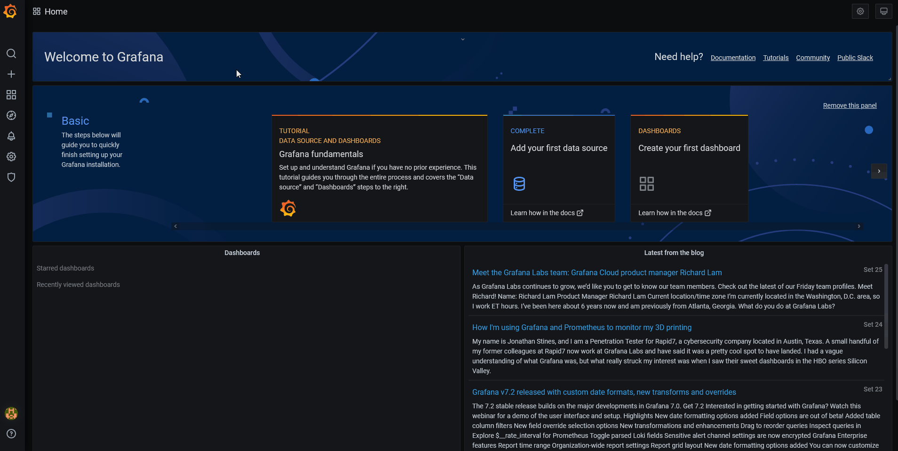

# Grafana Sample

## Stack

| Option | Description | Default Port in docker-file
| :------:| :-----------:| :------: |
| .NET Core   | [.NET Core Version 3.1](https://dotnet.microsoft.com/download/dotnet-core/3.1) |  ```http://localhost:8082```|
| Prometheus (set to go in docker compose file) | [From Docker Hub](https://hub.docker.com/r/prom/prometheus/) |```http://localhost:9090```|
| Grafana (set to go in docker compose file)   | [From Docker Hub](https://hub.docker.com/r/grafana/grafana/) |```http://localhost:3000```|

## Running the project

First create the docker images.

```
cd salesApp
docker build -f Dockerfile -t salesapp .
cd ../generator
docker build -f Dockerfile -t generator .
```

Now we can run all containers, go to the project root folder: `grafanaSample`, and execute:

```
docker-compose up
```

## Grafana

### Configure Data Source


### Import dashboard using JSON

You can use this sample [dashboard](Grafana/SampleDashboard.json).




## Tips

To remove all containers created in this project, remove using the `docker-compose down`.
